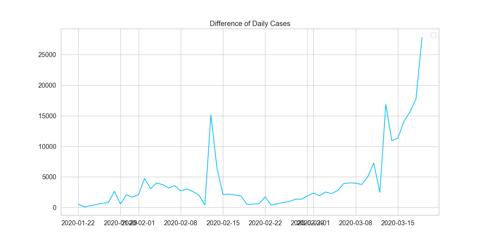

# Setup Conda Environment
#### create a conda environment from it as follows:
```shell script
conda env create -f environment.yml
```
# Get data
```shell script
wget https://raw.githubusercontent.com/CSSEGISandData/COVID-19/master/csse_covid_19_data/csse_covid_19_time_series/time_series_19-covid-Confirmed.csv
```


  


 


 


